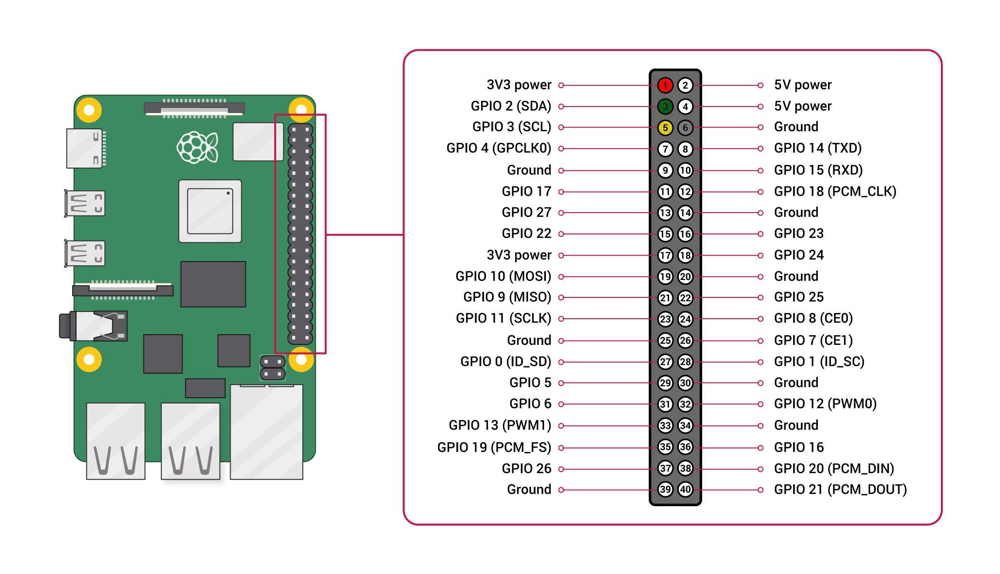

# Sensirion Raspberry Pi I2C SCD4x Driver

This document explains how to set up the SCD4x sensor to run on a Raspberry Pi
using the provided code.

[

](https://sensirion.com/my-scd-ek)

Click [here](https://sensirion.com/my-scd-ek) to learn more about the SCD4x
sensor and the SCD41 Evaluation Kit Board.

## Setup Guide

### Connecting the Sensor

Your sensor has the four different connectors: VCC, GND, SDA, SCL. Use
the following pins to connect your SCD4x:

 *SCD4x*  |    *Raspberry Pi*    | *Jumper Wire*
 :------: | :------------------: | :-----------:
   VCC    |        Pin 1         |      Red
   GND    |        Pin 6         |     Black
   SDA    |        Pin 3         |     Green
   SCL    |        Pin 5         |     Yellow

